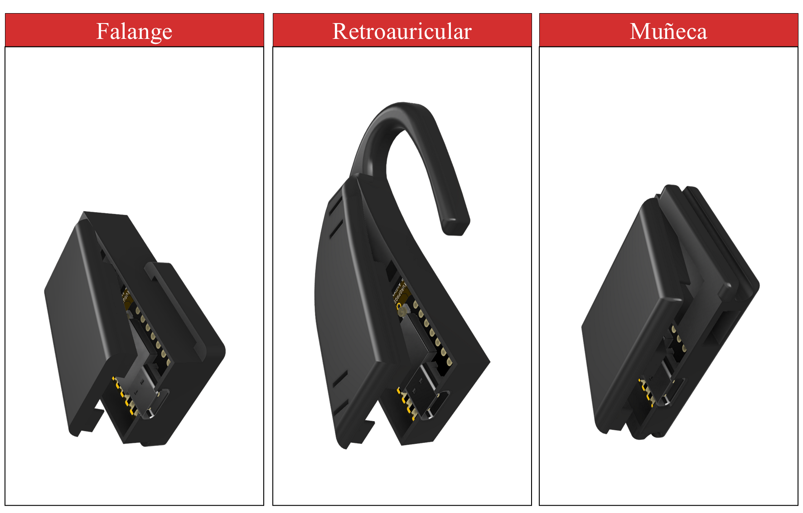

# SPEC-P6: An Open-Source, Modular, and Synchronized Wearable Sensor Platform

 

## Overview

SPEC-P6 is an open-source, reproducible, and modular wearable platform designed for simultaneous, multi-site acquisition of photoplethysmography (PPG) and inertial measurement unit (IMU) data. The system enables synchronized telemetry across multiple anatomical locations (specifically configured for the retroauricular region, wrist, and index finger) using a wireless star network architecture.

## System Architecture

The platform operates under a star network topology where a central Coordinator gathers data packets from multiple wearable Sensor Nodes via ESP-NOW and forwards them to a host computer through a high-speed serial link:

`PC (Python GUI) <-> Serial (921,600 baud) <-> Coordinator (ESP32) <-> ESP-NOW <-> Sensor Nodes (XIAO ESP32-C6)`

- **Sensor Node (Custom Hardware):** A compact custom PCB integrating a Seeed Studio XIAO ESP32-C6, a MAX30102 PPG sensor, an MPU6050 6-axis IMU, LDO voltage regulators, a 3.7V 100 mAh LiPo battery, and power management switches.
- **Coordinator (Functional Role):** A standard COTS ESP32 development board running firmware that bridges wireless ESP-NOW telemetry to a serial stream. It also provides a hardware digital/TTL synchronization trigger (Pin 2) for precise time-alignment with external DAQ systems (e.g., BIOPAC).

## Repository Structure

The repository is organized into the following directories:

- `/hardware/`: Contains custom PCB Gerber files, EAGLE source files (`.sch`, `.brd`), and the detailed Bill of Materials (BOM) with manufacturer part numbers.
- `/mechanical/`: Includes 3D printable `.STL` files and editable CAD source files for the wearable enclosures across all targeted anatomical sites.
- `/firmware/`: Houses the C/C++ source code for the Sensor Nodes and the Coordinator, alongside shared MAC address definitions.
- `/software/`: Contains the Python-based graphical acquisition suite (`spec_p6_acquisition_suite.py`), battery logging utilities, and `requirements.txt`. The GUI utilizes PyQt6 and PyQtGraph for high-performance rendering, and SciPy for real-time digital filtering of the raw signals.
- `/documentation/`: Contains printing guidelines (`PRINTING_SETTINGS.md`) and component assembly instructions.
- `/figures/`: High-resolution images of the hardware, GUI screenshots, and in-vivo placement examples.
- `/protocols/`: Markdown files describing acquisition, communication, and synchronization procedures.
- `/validation/`: Includes a sample dataset (`.csv`) for script testing and battery discharge logs.

## Key Technical Specifications

- **Target Sampling Rate:** 50 Hz steady for both PPG and IMU streams.
- **Wireless Protocol:** ESP-NOW (packaged in batches of 5 samples per transmission to optimize network bandwidth).
- **Concurrency:** FreeRTOS-based multitasking on the ESP32-C6 core for robust sensor polling and transmission without timing jitter.
- **Battery Life:** ~58 minutes of continuous multi-sensor transmission on a 100 mAh LiPo cell.
- **Timing Performance:** Low jitter (< 0.6 ms) and zero packet loss under standard laboratory testing conditions.

## Quick Start & Reproduction Guide

To deploy and operate the SPEC-P6 platform:

1. **Hardware Fabrication:** Order the PCB using the Gerber files in `/hardware/` and assemble following the BOM guidelines.
2. **Firmware Flashing:** 
   - Flash `coordinator.ino` onto your Coordinator ESP32 device.
   - Flash `sensor_node.ino` onto your XIAO ESP32-C6 nodes, ensuring MAC addresses are correctly mapped in the firmware definitions.
3. **Mechanical Enclosures:** Print the 3D cases located in `/mechanical/STL_files/`. Refer to `/documentation/PRINTING_SETTINGS.md` for specific Bambu Lab slicing parameters (TPU/PETG recommendations).
4. **Software Execution:** 
   - Install Python dependencies via `pip install -r software/requirements.txt`.
   - Run the acquisition suite using `python software/spec_p6_acquisition_suite.py`.

## How to Cite

If you use SPEC-P6 in your academic research, please cite it using the repository's DOI:

> Navarro-Torres, A., Rosas-Agraz, F., Vélez-Pérez, H. A., Romo-Vázquez, R., & Guzmán-Quezada, E. E. (2026). SPEC-P6: An open-source synchronized wearable platform for multisite photoplethysmography and inertial sensing. Zenodo. https://doi.org/10.5281/zenodo.22048827

See the `CITATION.cff` file for more details.

## License

To effectively cover both the software and physical hardware designs, this project employs a dual-licensing strategy:

- **Software and Firmware:** Licensed under the [MIT License](LICENSE-SOFTWARE).
- **Hardware and Mechanical Designs:** Licensed under the CERN Open Hardware Licence Version 2 - Weakly Reciprocal (CERN-OHL-W-v2). You may redistribute and modify the hardware documentation under the terms of the CERN-OHL-W v2 (https://ohwr.org/cernohl).
